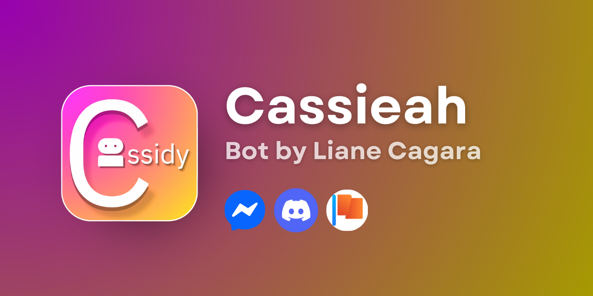

# CassieahBoT 4.0+ (Dev)

CassieahBoT (formerly CassidySpectra, forked from CassidyRedux, originally CassidyBoT) is a multi-platform chatbot framework for Facebook, Discord, and web. Maintained by Liane Cagara ([lianecagara on GitHub](https://github.com/lianecagara)), it uses TypeScript for robust tooling and now includes **napi-rs canvas** for image generation because text-only output is outdated. This is the 4.0+ dev branch, so expect rough edges. If you break something, that’s on you.

</img>

## Table of Contents

- [Overview](#overview)
- [Features](#features)
- [Changelog](#changelog)
- [Getting Started](#getting-started)
  - [Prerequisites](#prerequisites)
  - [Installation](#installation)
  - [Configuration](#configuration)
  - [Deployment](#deployment)
- [Writing Commands](#writing-commands)
  - [Command Structure](#command-structure)
  - [Meta Options](#meta-options)
  - [Context Variables](#context-variables)
  - [Example Command](#example-command)
- [Core Files](#core-files)
- [License](#license)

## Overview

CassieahBoT is a framework for building bots that work across Facebook (personal accounts and pages), Discord (partially), and web interfaces. It leverages TypeScript for type safety and includes **napi-rs canvas** for generating images dynamically. It’s extensible but not foolproof. If you don’t follow instructions, don’t expect it to work.

## Features

- **TypeScript Tooling**: Strong typing and autocomplete. Use a proper IDE or deal with the consequences.
- **Image Generation**: Uses **napi-rs canvas** to create images like memes or charts. Text output alone won’t cut it anymore.
- **Command Management**: Define and manage commands with a clear structure.
- **Multi-Platform**: Supports Facebook (personal and pages), Discord (limited), and web.
- **Premade Components**: Templates like `UTShop` and `GameSimulator` for common tasks.
- **Auto-Styling**: Commands get formatted titles and lines automatically.
- **MongoDB Abstraction**: Simplified database interaction. Still requires a valid MongoDB URI.
- **Idle Games**: Built-in support for idle game mechanics.
- **Plugins**: Parallel plugin execution with promises. Better than the old system.
- **User Management**: Handles permissions, roles, and inventory systems.
- **Custom Fonts**: Unicode fonts styled like Markdown.
- **API Integration**: Connect to external APIs for additional functionality.

## Changelog

- **4.0+ (Dev)**:
  - Added **napi-rs canvas** for image generation.
  - Improved plugin system with proper promise handling.
  - Simplified MongoDB abstraction.
  - Performance optimizations.
  - Discord support remains partial and undertested.
  - Fixed some bugs. New ones are probably lurking.

## Getting Started

Follow these steps exactly. If the bot doesn’t work, check the logs first before asking for help.

### Prerequisites

- GitHub account.
- Facebook Page (required for Messenger integration).
- Dummy Facebook account (don’t use your main one).
- Browser with extension support (e.g., Chrome, Edge, Kiwi).
- **Cookie Editor** or **C3C FBState** extension for exporting cookies.
- Railway account ([railway.app](https://railway.app)).
- Node.js 23.7.0 or higher. Older versions will fail.
- MongoDB URI (e.g., from MongoDB Atlas).
- Basic understanding of JavaScript/TypeScript and command-line tools.

### Installation

1. **Fork or Generate the Repository**:
   - Go to [https://github.com/lianecagara/CassieahBoT](https://github.com/lianecagara/CassieahBoT).
   - Fork or use the template to create your own repo (`https://github.com/your-username/CassieahBoT`).
   - Template is better for private repos.

2. **Clone the Repository**:
   ```bash
   git clone https://github.com/your-username/CassieahBoT
   cd CassieahBoT
   ```

3. **Run Update Command**:
   - Before touching *any* files, run:
     ```bash
     npm run update
     ```
   - This ensures dependencies and configs are up to date. If you skip this and modify files, updates will break. Don’t say I didn’t warn you.

4. **Install Dependencies**:
   ```bash
   npm install
   ```
   - If this fails, verify Node.js version (23.7.0+).

5. **Install napi-rs Canvas**:
   ```bash
   npm install @napi-rs/canvas
   ```
   - Linux users may need additional packages (`libcairo2-dev`, `libpango1.0-dev`). Search for solutions if it fails.

6. **Set Up Cookies**:
   - Log in to your dummy Facebook account.
   - Use **Cookie Editor** or **C3C FBState** to export cookies in JSON format.
   - Replace the contents of `cookie.json` with your cookies.
   - Run `node hidestate` if using an `.env` file to secure appstate.
   - **Warning**: Never commit `cookie.json` to a public repo. Use environment variables.

### Configuration

1. **Facebook Messenger Setup**:
   - Go to [developers.facebook.com](https://developers.facebook.com).
   - Create a Business app.
   - Add the **Messenger** product.
   - Link your Facebook Page and generate a **Page Access Token**.
   - Configure webhooks:
     - **Callback URL**: `https://your-railway-url/webhook` (set after deployment).
     - **Verify Token**: Create one (e.g., `pagebot`) and note it.
     - Subscribe to `messages`, `messaging_optins`, `messaging_postbacks`.
   - Update `settings.json`:
     ```json
     {
       "pageAccessToken": "your-page-access-token",
       "pageVerifyToken": "your-verify-token",
       "discordBotToken": "",
       "discordClientID": ""
     }
     ```
   - **Warning**: Keep tokens secure. Use environment variables.

2. **Discord (Optional)**:
   - Go to [Discord Developer Portal](https://discord.com/developers/applications).
   - Create a bot and copy its token.
   - Add to `settings.json`.
   - Discord support is partial. Test thoroughly or stick to Facebook.

3. **Database**:
   - Add your MongoDB URI to `.env`:
     ```env
     MONGO_URI="your-mongodb-uri"
     ```
   - Get a URI from MongoDB Atlas if you don’t have one.

### Deployment

1. **Local Testing**:
   ```bash
   npm start
   ```
   - If it fails, check `cookie.json`, `settings.json`, or logs.

2. **Railway Deployment**:
   - Log in to [railway.app](https://railway.app).
   - Create a new project and select your CassieahBoT repo.
   - Ensure the Dockerfile uses Node.js 23.7.0+.
   - Set environment variables:
     - `MONGO_URI`: Your MongoDB URI.
     - `APPSTATE`: Contents of `cookie.json` (or use the file).
   - Deploy to **USA Oregon** region. Other regions won’t work.
   - Get the Railway URL (e.g., `https://your-project-name.up.railway.app`).
   - Update Facebook webhook with `/webhook` (e.g., `https://your-project-name.up.railway.app/webhook`).

3. **Testing**:
   - Message your Facebook Page with “help” from a non-dummy account.
   - No response? Check Railway logs. It’s usually a misconfigured token or role.
   - Assign roles in [developers.facebook.com](https://developers.facebook.com) under **App Roles** to allow specific accounts to interact.

## Writing Commands

### Command Structure

Commands are defined in JavaScript/TypeScript files. Here’s the format:

```javascript
export const meta = {
    name: "example",
    otherNames: ["ex", "test"],
    author: "Your Name",
    version: "1.0.0",
    description: "Basic command example.",
    usage: "{prefix}{name} [arg]",
    category: "Misc",
    noPrefix: "both",
    permissions: [0],
    botAdmin: false,
    waitingTime: 5,
    ext_plugins: {
        output: "^1.0.0",
        canvas: "^1.0.0"
    },
    whiteList: null,
    args: [
        {
            degree: 0,
            fallback: null,
            response: "Provide an argument.",
            search: "arg",
            required: false
        }
    ],
    supported: "^4.0.0"
};

export async function entry({ input, output, args }) {
    output.reply(`You said: ${args[0] || "nothing"}`);
}
```

### Meta Options

- **name**: Primary command name.
- **otherNames**: Array of aliases.
- **author**: Command author.
- **version**: Command version (e.g., `1.0.0`).
- **description**: What the command does.
- **usage**: Syntax, including `{prefix}`.
- **category**: Command category.
- **noPrefix**: `"both"`, `true`, or `false` for prefix requirement.
- **permissions**: Array of `[0, 1, 2]` (0: anyone, 1: group admin, 2: bot admin).
- **botAdmin**: `true` if restricted to bot admins.
- **waitingTime**: Cooldown in seconds.
- **ext_plugins**: Required plugins (e.g., `canvas: "^1.0.0"` for images).
- **whiteList**: Array of allowed user IDs or `null`.
- **args**: Argument configs:
  - **degree**: Argument position (0-based).
  - **fallback**: Default value.
  - **response**: Error message for invalid args.
  - **search**: Argument identifier.
  - **required**: `true` or `false`.
- **supported**: Minimum CassieahBoT version (`^4.0.0`).

### Context Variables

- **input**:
  - `input.text`: Command text.
  - `input.senderID`: Sender’s ID.
  - `input.threadID`: Thread ID.
  - `input.arguments`: Argument array.
  - `input.isAdmin`: Admin status.
  - `input.replier`: Replier object.
- **output**:
  - `output.reply(text)`: Send text reply.
  - `output.error(err)`: Send error.
  - `output.send(text, id)`: Send to specific ID.
  - `output.add(user, thread)`: Add user to thread.
  - `output.kick(user, thread)`: Kick user.
  - `output.unsend(mid)`: Unsend message.
  - `output.reaction(emoji, mid)`: Add reaction.
  - `output.sendImage(buffer, id)`: Send image (new in 4.0+).
- **event**: Raw event data.
- **api**: Platform API.
- **commandName**: Command name.
- **args**: Parsed arguments.

### Example Command

A command using **napi-rs canvas** to generate an image:

```javascript
import { createCanvas, loadImage } from '@napi-rs/canvas';

export const meta = {
    name: "meme",
    otherNames: ["memegen"],
    author: "Your Name",
    version: "1.0.0",
    description: "Generates a meme with custom text.",
    usage: "{prefix}meme <text>",
    category: "Fun",
    noPrefix: false,
    permissions: [0],
    botAdmin: false,
    waitingTime: 10,
    ext_plugins: {
        output: "^1.0.0",
        canvas: "^1.0.0"
    },
    whiteList: null,
    args: [
        {
            degree: 0,
            fallback: null,
            response: "Provide text for the meme.",
            search: "text",
            required: true
        }
    ],
    supported: "^4.0.0"
};

export async function entry({ input, output, args }) {
    const text = args[0];
    const canvas = createCanvas(500, 500);
    const ctx = canvas.getContext('2d');

    const image = await loadImage('public/meme-template.jpg');
    ctx.drawImage(image, 0, 0, 500, 500);

    ctx.font = '30px Impact';
    ctx.fillStyle = 'white';
    ctx.strokeStyle = 'black';
    ctx.lineWidth = 2;
    ctx.textAlign = 'center';
    ctx.fillText(text.toUpperCase(), 250, 450);
    ctx.strokeText(text.toUpperCase(), 250, 450);

    const buffer = await canvas.encode('png');
    output.sendImage(buffer, input.threadID);
}
```

**Note**: Place a `meme-template.jpg` in `public/`. It’s not included.

## Core Files

- **Cassieah.js**: Core logic, command, and plugin handling.
- **api.js**: Developer API handlers.
- **loadCommand.js**: Command loading and registration.
- **loadPlugins.js**: Plugin management.
- **extends.js**: Additional utilities.

Don’t modify these unless you’re certain. Always run `npm run update` first.

## License

See the `LICENSE` file for details.

## Credits

- **MrKimstersDev (Symer Steve Berondo)**: Original tutorial.
- **Liane Kaye Cagara**: Creator and maintainer.

---

**Important**: Always run `npm run update` before editing any files, or updates will break. If the bot isn’t responding, check the logs (Railway or local). Most issues are due to misconfigured tokens, cookies, or roles. Don’t skip steps, and don’t expect it to work if you half-read this.